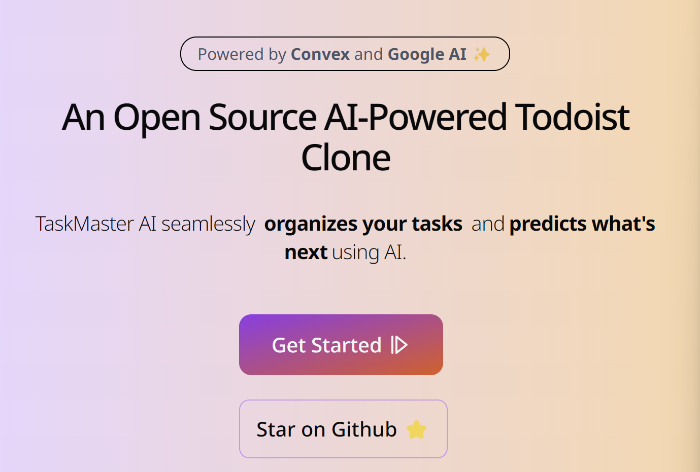

# Task Master AI: Your Intelligent Personal Organizer

Built with the Next.js 14 App Router, Convex, React, Next.js Auth V5 i.e. Auth.js, Google Sign in, ShadCN UI library, React Hook Forms, TypeScript, Google AI, TailwindCSS and more

## Features

- 🌐 Next.js & Server actions
- 🤖 AI Suggest Missing Tasks and Sub-Tasks using Open AI
- 🎨 Beautiful components using Shadcn UI
- 💅 Slick designs using TailwindCSS
- 🌟 Database using Convex
- 🎭 Amazing icons thanks to Lucide React
- 🔐 Auth using Next Auth aka Auth.js
- 📋 Typescript Runtime Validation using Zod
- 🚀 Form Validation using React Hook Forms
- ❤️ Add Task Dialog popup
- 💔 Deletion of Tasks Dialog popup
- ✚ Addition of Sub-Tasks
- 💔 Deletion of Sub-Tasks Dialog popup
- 📜 Creation of New Projects and Labels
- 📜 Deletion of New Projects and Labels
- 🔄 Sidebar Navigation
- 📱Full mobile responsiveness
- 🛬 Landing page 🛬
- 📱 Mobile responsiveness
- 🎁 ...much more

## Getting started
